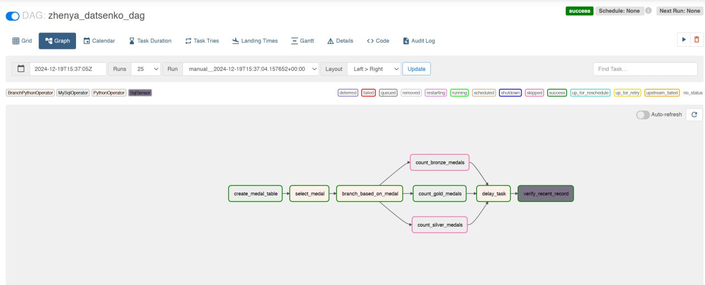

# Apache Airflow

## Step-by-Step Instructions for Completing the Task

### Write a DAG with the Following Tasks (Each Point → One Task)

### 1. Create a Table

- Use `IF NOT EXISTS` with the following fields:
  - `id` (auto-increment, primary key)
  - `medal_type`
  - `count`
  - `created_at`

### 2. Randomly Select a Value

- Choose one of the three values `['Bronze', 'Silver', 'Gold']` at random.

### 3. Conditional Branching

- Based on the selected value, trigger one of the following three tasks.

### 4. Description of the Three Tasks

1. Count the number of records in the table `olympic_dataset.athlete_event_results` where the `medal` field contains `Bronze`, and write the resulting count to the table created in step 1, along with the medal type and the record's creation time.
2. Count the number of records in the table `olympic_dataset.athlete_event_results` where the `medal` field contains `Silver`, and write the resulting count to the table created in step 1, along with the medal type and the record's creation time.
3. Count the number of records in the table `olympic_dataset.athlete_event_results` where the `medal` field contains `Gold`, and write the resulting count to the table created in step 1, along with the medal type and the record's creation time.

### 5. Add a Delay

- Use the `PythonOperator` with the function `time.sleep(n)` to create a delay for the next task if one of the previous three tasks executes successfully.

### 6. Use a Sensor for Validation

- Use a sensor to check whether the newest record in the table created in step 1 is no older than 30 seconds compared to the current time. The goal is to confirm that a record has actually been written to the table.
- Create a 35-second delay in step 5 to ensure the sensor fails if the delay exceeds 30 seconds.

---

## Criteria for Homework Acceptance and Evaluation

1. **Table Creation (10 points)**  
   Create a table using the provided specifications.

2. **Random Value Generation (10 points)**  
   Randomly generate a value from `['Bronze', 'Silver', 'Gold']`.

3. **Branching (15 points)**  
   Implement conditional logic to execute one of three tasks based on the selected value.

4. **Task Execution (25 points)**  
   Count the number of records in the specified table and save the results appropriately.

5. **Execution Delay (15 points)**  
   Implement a delay for the next task using `PythonOperator`.

6. **Record Validation (25 points)**  
   Validate the newest record in the table is no older than 30 seconds using a sensor.

## TASK RESULTS

### 1. General structure of the DAG

The DAG consists of the following tasks:

1. **create_medal_table**

   - **Purpose:** Creates a table in the database or verifies if it already exists.
   - **Outcome:** Successfully creates the table.

2. **select_medal**

   - **Purpose:** Randomly selects one medal type (Gold, Silver, Bronze).
   - **Outcome:** Successfully selects a medal.

3. **branch_task**

   - **Purpose:** Determines the branch to execute for medal count calculation based on the selected medal type.
   - **Outcome:** Executes the branch corresponding to the selected medal (e.g., `count_gold_medals`, `count_silver_medals`, or `count_bronze_medals`). Other branches are skipped.

4. **delay_task**

   - **Purpose:** Introduces a 20-second delay to simulate data processing.
   - **Outcome:** Completes successfully after the delay.

5. **check_recent_record**
   - **Purpose:** Verifies that the most recent record in the `neo_data.lesia_soloviova_medal_counts` table is no older than 30 seconds.
   - **Outcome:**
     - **Success:** If a recent record is found.
     - **Failure:** If no record is found within the timeout period.

---

### Conclusions

- The **primary tasks** (`create_medal_table`, `select_medal`, and one medal counting branch) are **consistently successful**.
- The **delay_task** runs as expected, simulating a data processing pause.
- The **check_recent_record** task occasionally fails when no new record appears within the 30-second window.
- To improve reliability, consider **adjusting the timeout** or ensuring **data availability** during execution.

### 2. GRID WITH DAG RESULTS

# DAG Runs Summary

- **Total Runs Displayed:** 18
- **Total Success:** 2 (marked in green)
- **Total Failed:** 16 (marked in red)
- **First Run Start:** 2024-11-30, 16:55:10 UTC
- **Last Run Start:** 2024-11-30, 19:10:19 UTC
- **Max Run Duration:** 00:03:22
- **Mean Run Duration:** 00:01:10
- **Min Run Duration:** 00:00:06

### Conclusions

1. The DAG's **logic executes correctly**, but the `verify_recent_record` task frequently fails due to the absence of records matching the verification criteria at the specified time.
2. The failures are likely a result of **numerous experiments conducted**, which impacted the availability of valid records during runs.
3. Adjustments to the verification task or the testing environment may help reduce failures and improve overall reliability.

### 3. DAG RESULTS IN DB

### Conclusions

The screenshot confirms that the table was created successfully, and the DAG execution consistently recorded processing results into the table without issues.
